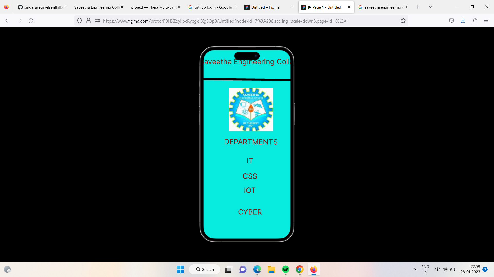

# Event Registration Web Application

## AIM:
To design, develop and deploy a web application for event registration.

## DESIGN STEPS:

### Step 1:
Create a new frame.

### Step 2:
Select any one preset size of your choice.

### Step 3:
Select the shapes you need.

### Step 4:
Import images as needed.

### Step 5:
Create pages based on your need and link them.

### Step 6:

Validate the HTML and CSS code.

### Step 6:

Publish the website in the given URL.

## DESIGN TOOL:
Figma

## CODE:
```
/* Home page */
position: relative;
width: 588px;
height: 1126px;
background: #FE0707;


/* Login page */
position: relative;
width: 571.39px;
height: 1125.78px;
background: #FF0B80;


/* Saveetha Engineering Collage */
position: absolute;
width: 522px;
height: 68px;
left: 10px;
top: 35px;
font-family: 'Inter';
font-style: normal;
font-weight: 400;
font-size: 36px;
line-height: 44px;
text-align: center;
color: #A30A0A;


/* DEPARTMENTS */
position: absolute;
width: 511px;
height: 62.87px;
left: 15.38px;
top: 430px;
font-family: 'Inter';
font-style: normal;
font-weight: 400;
font-size: 36px;
line-height: 44px;
text-align: center;
color: #A30A0A;


/* IT */
position: absolute;
width: 511px;
height: 62.87px;
left: 10.38px;
top: 524px;
font-family: 'Inter';
font-style: normal;
font-weight: 400;
font-size: 36px;
line-height: 44px;
text-align: center;
color: #A30A0A;


/* CSS */
position: absolute;
width: 511px;
height: 62.87px;
left: 10.38px;
top: 600px;
font-family: 'Inter';
font-style: normal;
font-weight: 400;
font-size: 36px;
line-height: 44px;
text-align: center;
color: #A30A0A;


/* IOT */
position: absolute;
width: 511px;
height: 62.87px;
left: 10.38px;
top: 670px;
font-family: 'Inter';
font-style: normal;
font-weight: 400;
font-size: 36px;
line-height: 44px;
text-align: center;
color: #A30A0A;


/* CYBER */
position: absolute;
width: 511px;
height: 62.87px;
left: 10.38px;
top: 777px;
font-family: 'Inter';
font-style: normal;
font-weight: 400;
font-size: 36px;
line-height: 44px;
text-align: center;
color: #A30A0A;


/* Line 3 */
position: absolute;
width: 607.01px;
height: 0px;
left: 575px;
top: 148.12px;
border: 9px solid #000000;


/* sanz 3 */
position: absolute;
width: 219.07px;
height: 212.97px;
left: 161px;
top: 189px;
background: url(sanz.jpg);
```
## OUTPUT:




## RESULT:
The program to design, develop and deploy a web application for event registration is completed successfully.